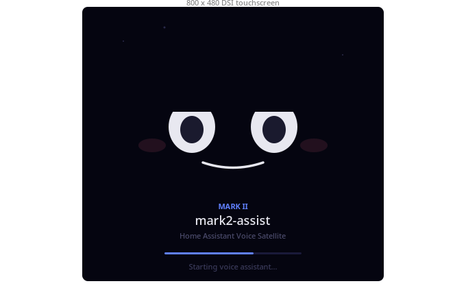
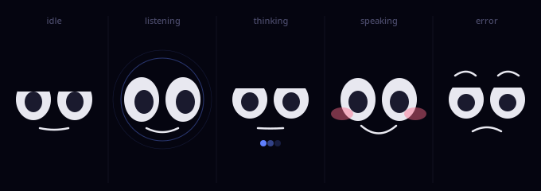
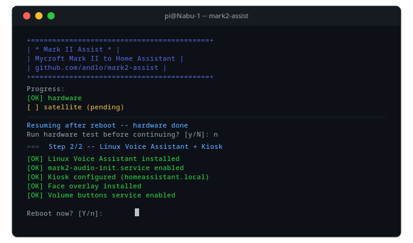

# Mycroft Mark II Assist

<p align="center">
  
  
  
  
</p>

<p align="center">
  <strong>Repurpose your Mycroft Mark II as a Home Assistant voice satellite with touchscreen kiosk display.</strong>
</p>

---

**mark2-assist** turns a Mycroft Mark II into a fully-featured Home Assistant voice satellite:

- **Voice** via [Linux Voice Assistant](https://github.com/OHF-Voice/linux-voice-assistant) (ESPHome protocol, same as HA Voice PE)
- **Wake word** detection runs locally on-device ("okay nabu" default, changeable in HA UI)
- **Touchscreen** shows your HA dashboard directly — no configuration needed
- **Animated face** overlays the screen during voice interaction (listen → think → speak)
- **Screensaver** blanks the display after inactivity (timeout configurable in HA UI)
- **Zero-config install** — everything configures itself; change settings in HA UI

The voice pipeline runs through Home Assistant Assist. You choose what powers it:
fully local (Whisper + Piper), Nabu Casa, OpenAI, Claude, or any HA conversation agent.

<p align="center">
  
</p>

---

## Hardware

| Component | Details |
|-----------|---------|
| Base board | Mycroft Mark II carrier board |
| Compute | Raspberry Pi 4 Model B (2–4 GB RAM) |
| Audio | SJ201 board — XMOS XVF-3510 mic array + TAS5806 amplifier |
| Display | Waveshare 4.3" 800×480 DSI touchscreen |
| OS | Raspberry Pi OS Lite **Trixie** (Debian 13, 64-bit) |

> **Note:** Pi 5 untested. Pi 3 not supported (insufficient RAM).

---

## How it works

### Voice satellite
LVA uses the ESPHome protocol and auto-discovers in HA as an ESPHome device.
After install it appears in **Settings → Devices & Services → ESPHome** automatically.

From there you can configure (in HA UI, no SSH needed):
- Satellite name
- Active wake word(s) and sensitivity
- Microphone gain and noise suppression
- Volume
- Screensaver timeout

### Kiosk display
Chromium opens `http://homeassistant.local/` in fullscreen kiosk mode.
HA redirects to the user's default dashboard automatically.

To use a specific dashboard, set it as the default for the HA user used on the kiosk,
or set `HA_URL` in `~/.config/mark2/config` to point to a specific dashboard path.

### Face animation
A transparent Chromium window sits on top of the HA dashboard as an always-on-top overlay.
It shows the Mark II face animation:

<p align="center">
  
</p>

| State | Face |
|-------|------|
| Idle | Eyes half-closed, slow blink |
| Listening | Eyes open, pupils wander |
| Thinking | Squinting, animated dots |
| Speaking | Smiling, animated mouth |
| Error | Sad, furrowed brows |

The face fades out after a few seconds of idle and reappears on wake word detection.

### Screensaver
The display blanks after inactivity (default: 5 minutes). Any touch or voice activity wakes it.
Timeout is set via `SCREEN_BLANK_SECONDS` in `~/.config/mark2/config`.
Configurable from HA UI is planned — see [issue #30](https://github.com/andlo/mark2-assist/issues/30).

### XVF-3510 microphone
The XMOS XVF-3510 chip requires a specific 12.288 MHz clock (MCLK) and SPI slave boot
on every power-up. `mark2-audio-init.service` handles this automatically at boot.
See [docs/XVF3510_HARDWARE.md](docs/XVF3510_HARDWARE.md) for technical details.

---

## Installation

### Prerequisites

1. **Raspberry Pi OS Lite Trixie** (64-bit), freshly flashed via [Raspberry Pi Imager](https://www.raspberrypi.com/software/)
   - Enable SSH, set username (`pi` recommended) and password in Imager advanced settings
   - Enable WiFi if not using ethernet
   - A fresh flash is strongly recommended — existing installations may have conflicting packages
2. **SSH access** to the device on your network
3. **Home Assistant** running on the same network

### Quickstart (recommended)

`install.sh` handles both steps and the reboot in between:

```bash
# Update the system and install git
sudo apt update && sudo apt upgrade -y
sudo apt install -y git

# Clone and run
git clone https://github.com/andlo/mark2-assist.git
cd mark2-assist
./install.sh
# → hardware setup → reboot → log back in → ./install.sh → satellite setup → reboot
```

<p align="center">
  
</p>

### Manual step-by-step

**Step 1: Hardware setup**
```bash
./mark2-hardware-setup.sh
sudo reboot
```
Installs: SJ201 kernel driver, DTBO overlays, Python venv, clock utilities (setup_mclk/setup_bclk), WirePlumber audio profile.

**Step 2: Satellite + kiosk**
```bash
./mark2-satellite-setup.sh
sudo reboot
```
Installs: Linux Voice Assistant, mark2-audio-init service, face animation overlay, Weston kiosk, Chromium, volume buttons, PipeWire config.

**No prompts in either step.** Everything configurable in HA UI afterwards.

### After reboot

```bash
# Services running?
systemctl --user status mark2-audio-init lva wireplumber

# Microphone working?
pw-record --rate 16000 --channels 1 --format s16 /tmp/test.wav
# (wait 3s, Ctrl-C — should have non-zero samples)

# LVA connected to HA?
journalctl --user -u lva -f
# Look for: ✅ Connected to Home Assistant
```

### In Home Assistant

1. **ESPHome device appears automatically** — Settings → Devices & Services
2. **Set voice pipeline** — Settings → Voice Assistants → your Mark II
3. **Say "okay nabu"** — face animates, voice command processed
4. **Configure** satellite name, wake word, volume, mic gain in HA UI

---

## Optional configuration

`~/.config/mark2/config` — created automatically, edit to override defaults:

```bash
# HA URL (if homeassistant.local doesn't resolve)
HA_URL=http://192.168.1.100:8123

# HA long-lived access token (for face bridge and screensaver sync)
HA_TOKEN=eyJ...

# Screensaver timeout in seconds (0 = never blank)
SCREEN_BLANK_SECONDS=300
```

---

## Optional modules

Modules for Snapcast, AirPlay, MPD and KDE Connect will be manageable
directly from the HA UI in a future update — see [issue #31](https://github.com/andlo/mark2-assist/issues/31).

Until then, install manually after the base setup:

```bash
bash modules/snapcast.sh   # synchronized multiroom audio
bash modules/airplay.sh    # AirPlay 1 speaker
bash modules/mpd.sh        # local music player
bash modules/kdeconnect.sh # Android integration
```

See [docs/MODULES.md](docs/MODULES.md) for details.

---

## Troubleshooting

### Microphone silent
```bash
journalctl --user -u mark2-audio-init
# Should show: MCLK at 12288.000kHz, Sending complete, Done
# If not: bash /usr/local/bin/mark2-xvf-post-wp.sh
```

### Touchscreen shows wrong page / mDNS not working
```bash
echo 'HA_URL=http://192.168.x.x:8123' >> ~/.config/mark2/config
# Then restart kiosk: pkill chromium && ~/kiosk.sh &
```

### LVA not discovered in HA
```bash
journalctl --user -u lva -f
# Check HA firewall allows port 6053 from Mark II IP
```

### Face not appearing
```bash
cat /tmp/mark2-face.log
cat /tmp/mark2-face-event.json
# Should contain: {"state": "idle", "ts": ...}
```

### Hardware test
```bash
./mark2-hardware-test.sh
```

---

## Documentation

| Document | Description |
|----------|-------------|
| [docs/XVF3510_HARDWARE.md](docs/XVF3510_HARDWARE.md) | XVF-3510 mic chip technical details, MCLK root cause, boot sequence |
| [docs/SATELLITE_SETUP.md](docs/SATELLITE_SETUP.md) | Satellite + kiosk setup technical reference |
| [docs/HARDWARE_SETUP.md](docs/HARDWARE_SETUP.md) | Hardware driver setup details |
| [docs/INSTALL_SH.md](docs/INSTALL_SH.md) | install.sh architecture and flow |
| [docs/MODULES.md](docs/MODULES.md) | Optional modules — manual install + planned HA UI management |
| [docs/HA_INTEGRATION.md](docs/HA_INTEGRATION.md) | Home Assistant integration guide |
| [docs/HISTORY.md](docs/HISTORY.md) | Project history and design decisions |

---

## Contributing

Issues and pull requests welcome.
Please test on actual Mark II hardware before submitting audio/kiosk changes.

## License

MIT
